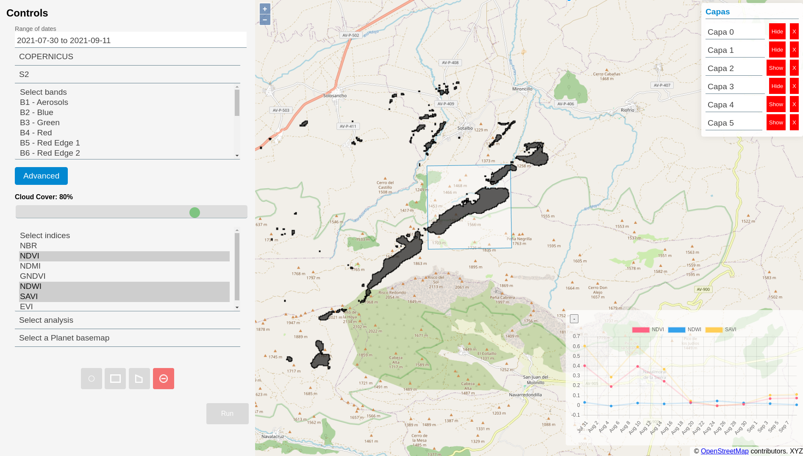
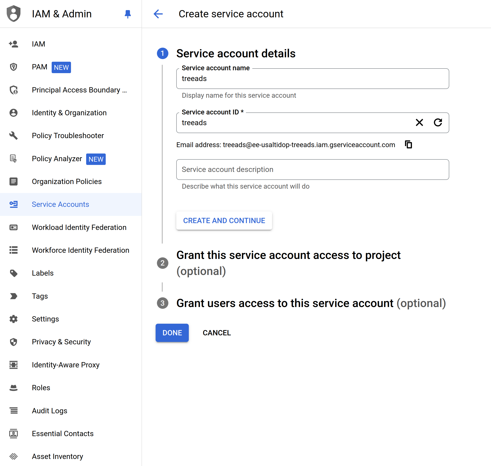
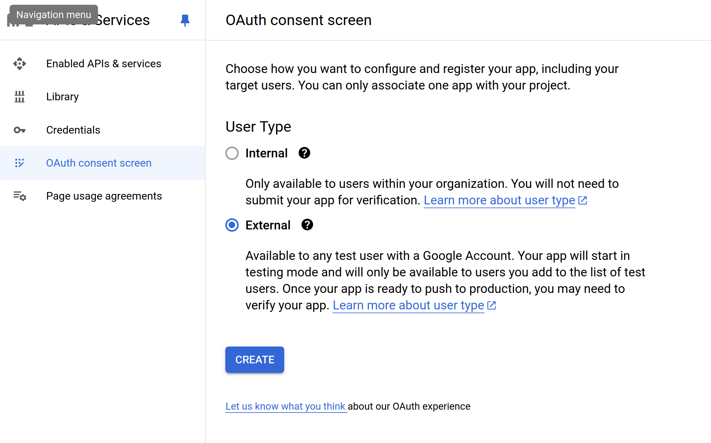
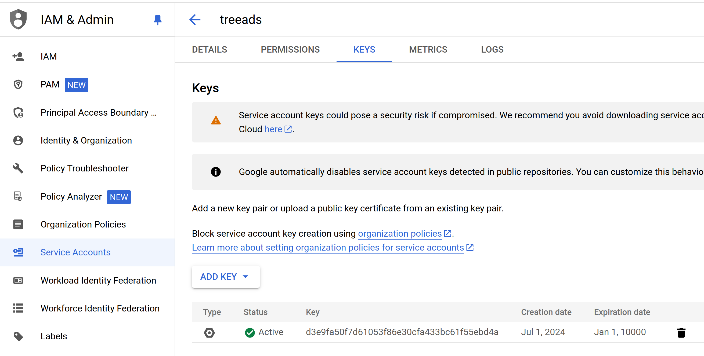

# Earth Engine Demo in Node.js

Ejemplo de muestra cómo crear una aplicación web sencilla de Google App Engine que se comunica con Google Earth Engine. Tras una implementación exitosa, verá una página web con un mapa interactivo.

En la carpeta _examples_ se encuentras trozos de código de [Code Editor de Earth Engine](https://code.earthengine.google.com/)

Se han generado una serie de rutas para acceder a funcionalidades de GEE de parte del servidor. Estas rutas son las siguientes:

- **get-mapid**: Devuelve el formato de URL de la capa analizada
- **get-hotspot**: Obtiene un mapa de hotspot
- **get-available-dates**: Devuelve las fechas disponibles para la base de datos de interés
- **get-hillshade**: Obtiene el mapa de sombras de un área
- **display-img**: Obtiene las url de la serie de imágenes de un rango definido.
- **get-indices-area**: Obtiene los indices de vegetación para un área de interés:
    - NDVI: Normalized Difference Vegetation Index
    - NDWI: Normalized Difference Water Index
    - NDMI: Normalized Difference Moisture Index
    - GVMI: Global Vegetation Moisture Index
    - SAVI: Soil Adjusted Vegetation Index
    - EVI: Enhanced Vegetation Index

Por último, también se cuenta con el acceso a las imágenes de alta resolución [Planet](https://planet.com/), que provee de un mosaico global a paso mensual.



To set the app up yourself, download the Earth Engine API repository from
GitHub:

```
git clone https://github.com/google/earthengine-api.git
```

Navigate to the Node.js Server Auth example code:

```
cd ./earthengine-api/demos/server-auth-nodejs
```

Then follow the instructions in the Developer Docs to
[deploy an EE-based App Engine app](https://developers.google.com/earth-engine/app_engine_intro#deploying-app-engine-apps-with-earth-engine).
For the credentials section, you'll need a Service Account, not an OAuth2 Client
ID. Next:

1.  Create Google Cloud Platform credentials and key.
    * https://console.cloud.google.com/apis/
    * Got to "Credentials", "Create credentials", "Service acount".

      

      
      
    * "OAuth consent screen"
      
      
      
      
    * Create Key for created credentials.
      
      
2.  Rename the downloaded Service Account JSON private key file to
    `.private-key.json` and move it into the `demos/server-auth-nodejs` folder.
    
4.  [Create an API key](https://developers.google.com/maps/documentation/javascript/get-api-key)
    and include it in `index.html` to properly initialize the Google Maps API.

Se puede acceder a la documentación de la API mediante la siguiente ruta:
[http://localhost:3000/api-docs/](http://localhost:3000/api-docs/)

<!-- Fuentes de interés:

http://www.gisandbeers.com/scripts-para-google-earth-engine/

https://courses.spatialthoughts.com/end-to-end-gee.html

https://docs.google.com/document/d/1ZxRKMie8dfTvBmUNOO0TFMkd7ELGWf3WjX0JvESZdOE/edit#heading=h.en7qomniyers


http://docs.tethysplatform.org/en/stable/tutorials/google_earth_engine.html

http://docs.tethysplatform.org/en/stable/tutorials/google_earth_engine/part_1/vis_gee_layers.html

https://github.com/giswqs/qgis-earthengine-examples

https://geemap.org/workshops/GeoPython_2021/

 -->
